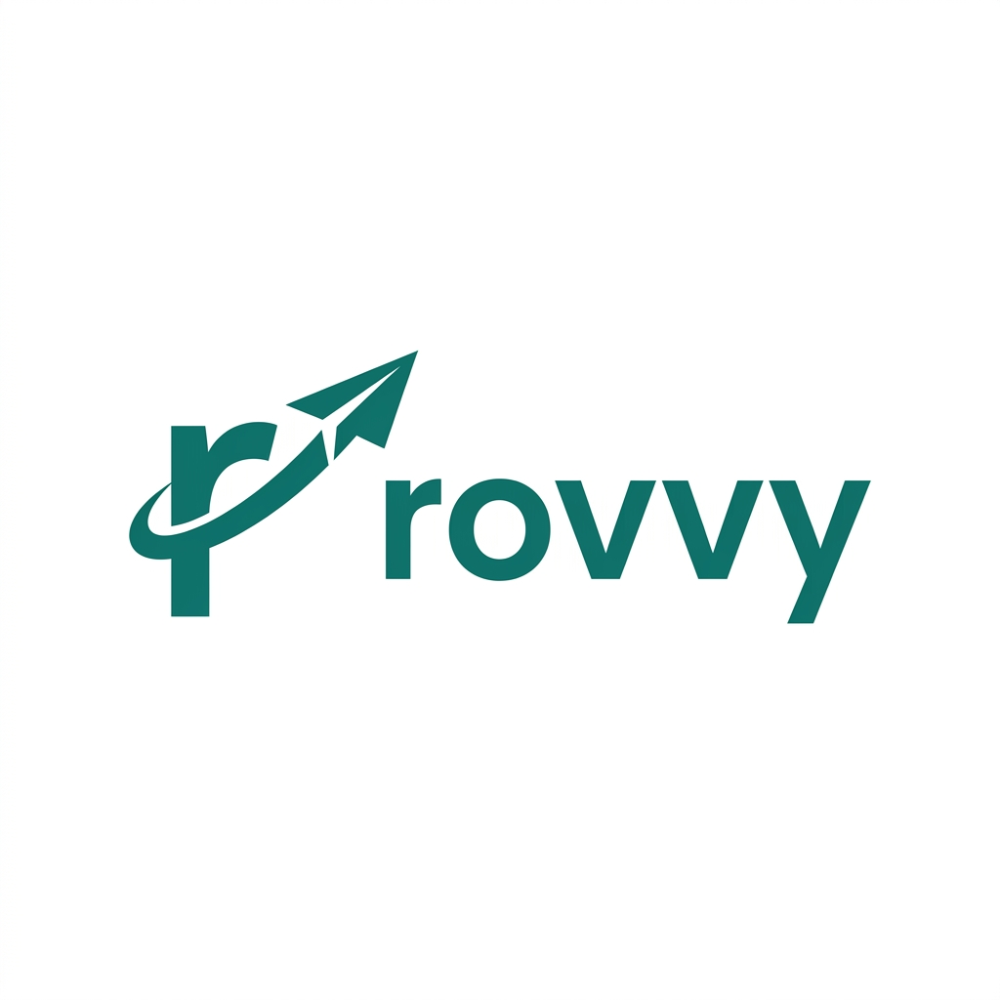
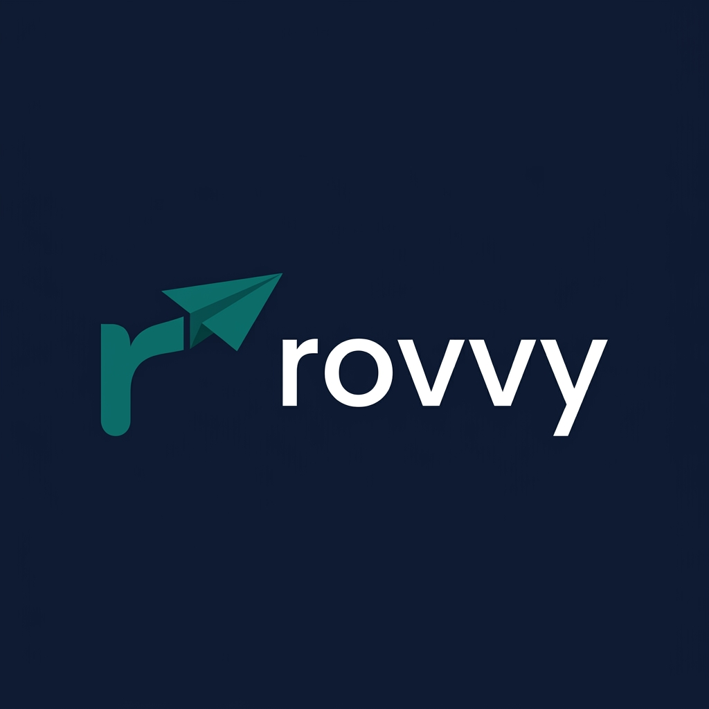
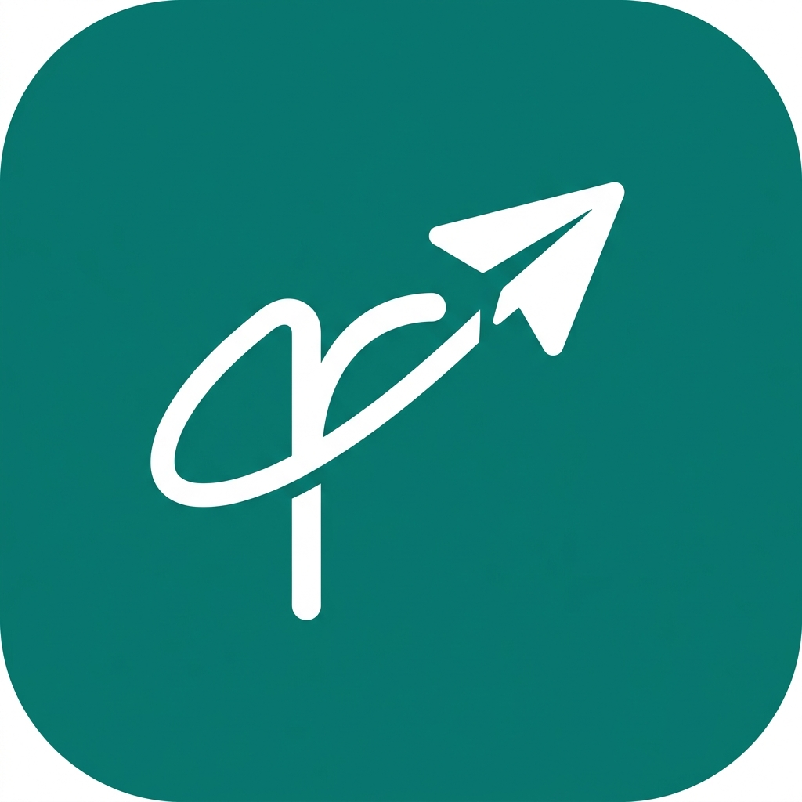
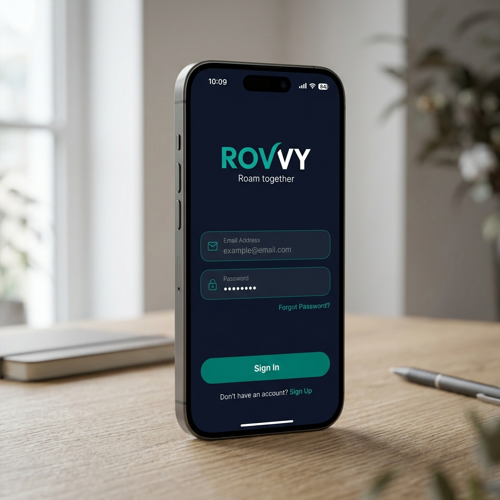
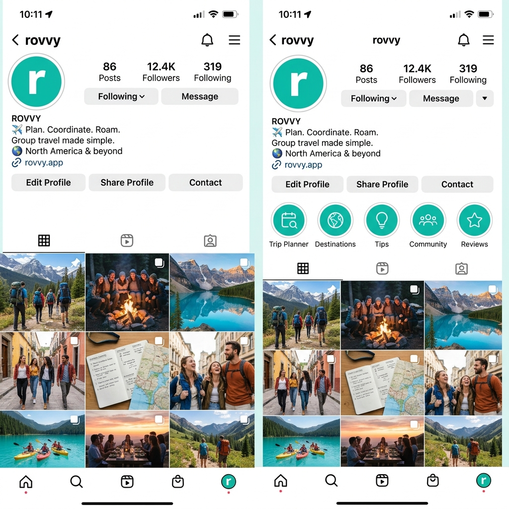
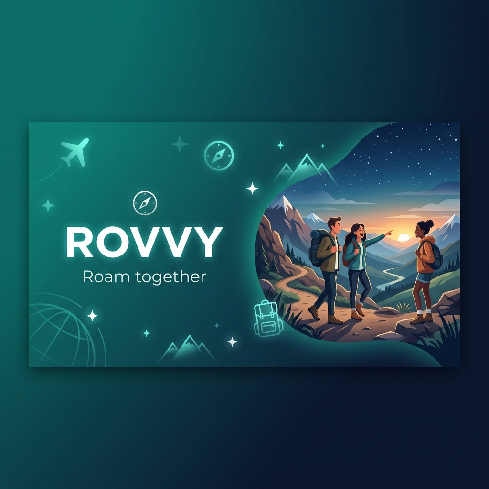
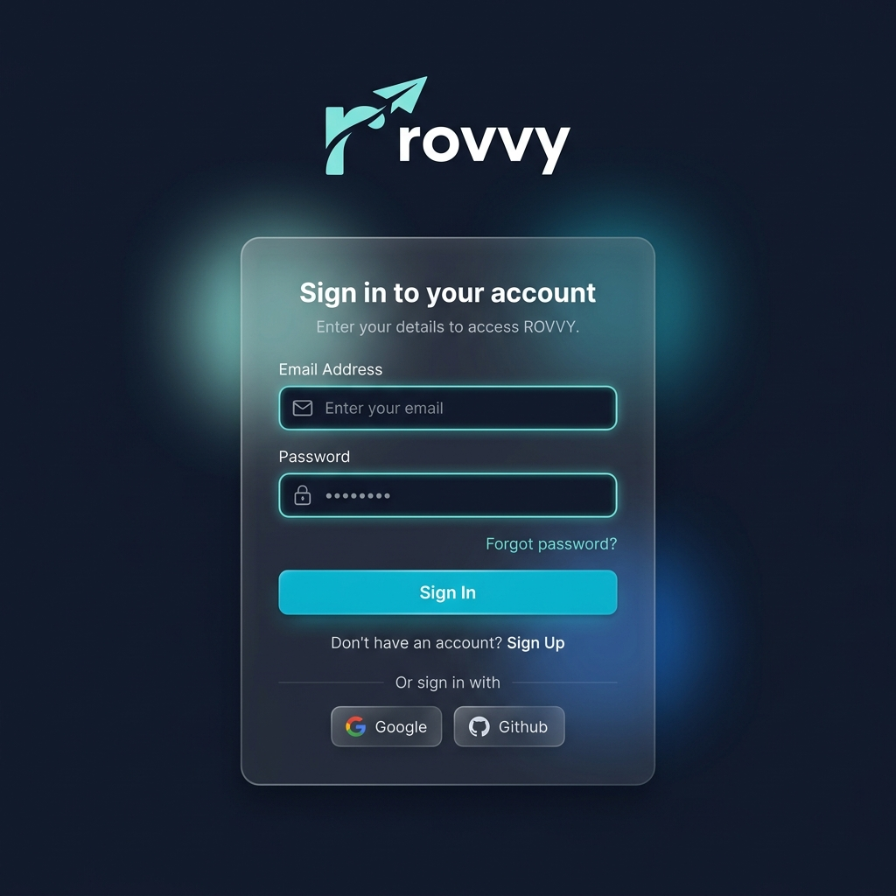
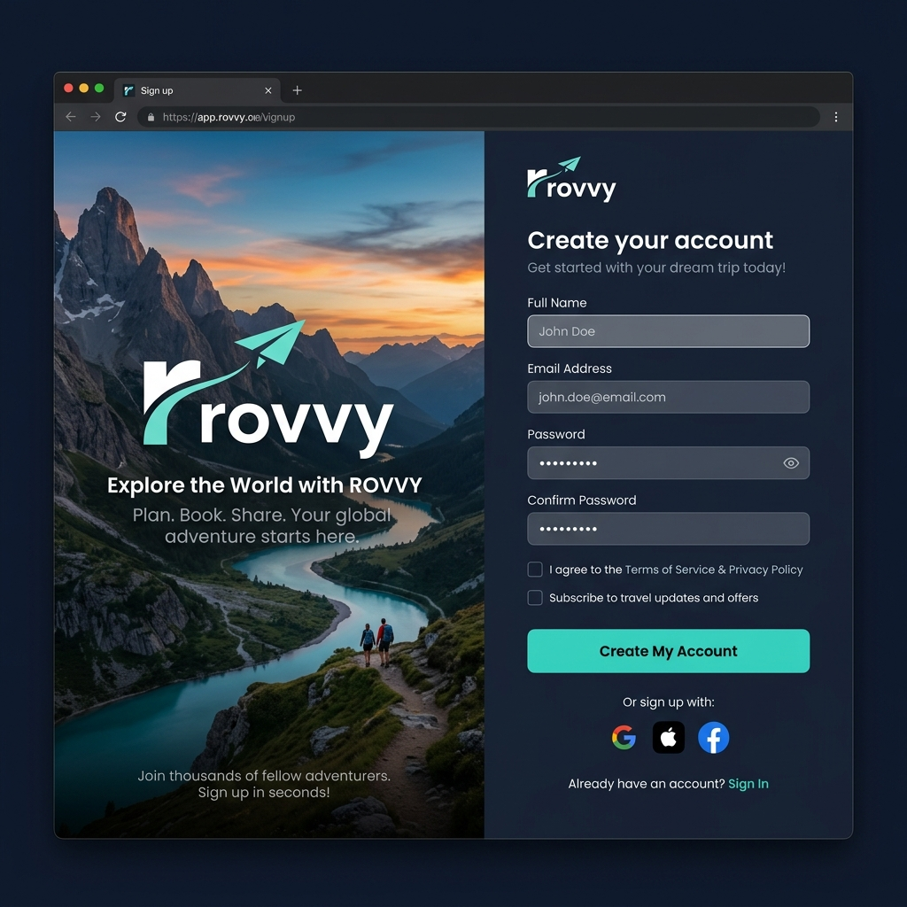
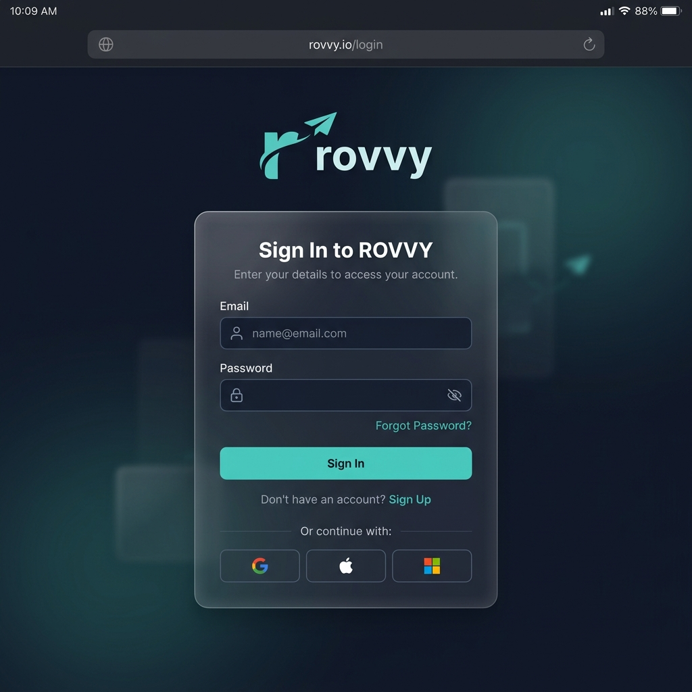

# ROVVY Brand Guide

## Brand Brief
- **Name**: ROVVY
- **Tagline**: "Roam together"
- **Type**: Group travel coordination app
- **Target users**: Friend groups, students, young professionals aged 18-35
- **Personality**: Modern, premium, social, adventurous
- **Hero Color**: Teal (#0F766E)

## 1. Logo Design

### Primary Logo

- **Style**: Minimalist, flat, premium
- **Color**: Teal (#0F766E) on white background
- **Usage**: Use on light backgrounds.

### Dark Logo

- **Usage**: Use on dark backgrounds (#0F172A).

### App Icon

- **Usage**: Mobile app icon, favicon concepts.

## 2. Color Palette

| Color | Hex | RGB | Usage |
| :--- | :--- | :--- | :--- |
| **Primary** | `#0F766E` | `15, 118, 110` | Hero elements, primary buttons, accents |
| **Dark Background** | `#0F172A` | `15, 23, 42` | Main background for dark mode |
| **Surface** | `#1E293B` | `30, 41, 59` | Cards, modals, elevated surfaces |
| **Accent/Highlight**| `#CCFBF1` | `204, 251, 241`| Light backgrounds, highlights, active states |
| **Text Primary** | `#F8FAFC` | `248, 250, 252`| Main text on dark backgrounds |
| **Text Muted** | `#94A3B8` | `148, 163, 184`| Secondary text, placeholders |
| **Success** | `#22C55E` | `34, 197, 94` | Success messages, positive indicators |
| **Warning** | `#F59E0B` | `245, 158, 11` | Warnings, pending states |
| **Error** | `#EF4444` | `239, 68, 68` | Errors, destructive actions |

## 3. Typography

### Primary Font: **Outfit**
- **Type**: Sans-serif
- **Source**: Google Fonts
- **Usage**: Headings, brand elements

### Secondary Font: **Inter**
- **Type**: Sans-serif
- **Source**: Google Fonts
- **Usage**: Body text, UI elements, small text

### Type Scale
- **H1**: Outfit Bold (32px / 2rem)
- **H2**: Outfit SemiBold (24px / 1.5rem)
- **H3**: Outfit Medium (18px / 1.125rem)
- **Body**: Inter Regular (16px / 1rem)
- **Caption**: Inter Regular (12px / 0.75rem)

## 4. Brand Mockups

### iPhone Login Screen

### Instagram Profile

### App Store Header

### Web Browser Login

### Mac Browser Sign Up

### Tablet Browser Login

